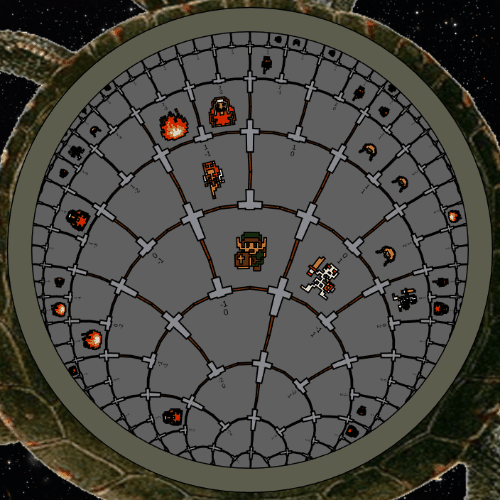
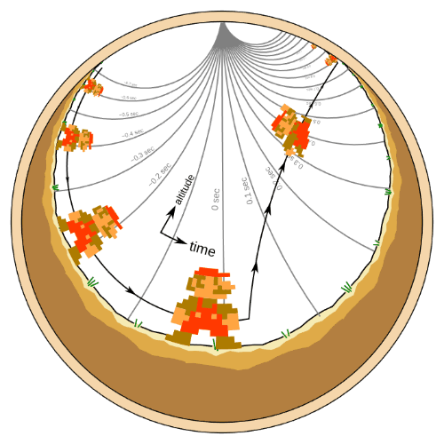
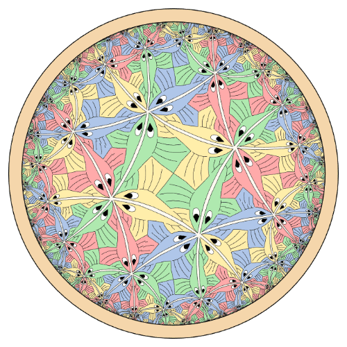
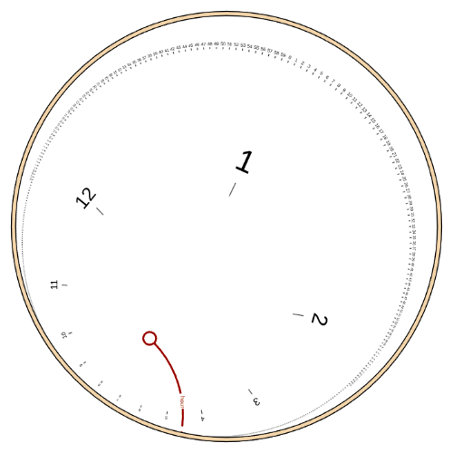

# Hyperbolic Map

A JavaScript map widget that draws vector graphics on [the hyperbolic plane](https://en.wikipedia.org/wiki/Hyperbolic_geometry), projected as [a Poincaré disk](https://en.wikipedia.org/wiki/Poincar%C3%A9_disk_model). Think of it like Google Earth for a negatively curved surface, rather than a sphere, which is positively curved.

<table>
<tr>
<td align="center" width="50%"><a href="https://jpivarski.github.io/hyperbolic-map/dungeon-man.html"></a><br><a href="https://jpivarski.github.io/hyperbolic-map/dungeon-man.html">Dungeon Man</a></td>
<td align="center" width="50%"><a href="https://jpivarski.github.io/hyperbolic-map/jumping-man.html"></a><br><a href="https://jpivarski.github.io/hyperbolic-map/jumping-man.html">Jumping Man</a></td>
</tr>
<tr>
<td align="center" width="50%"><a href="https://jpivarski.github.io/hyperbolic-map/escher.html"></a><br><a href="https://jpivarski.github.io/hyperbolic-map/escher.html">Circle Limit III</a></td>
<td align="center" width="50%"><a href="https://jpivarski.github.io/hyperbolic-map/clock.html"></a><br><a href="https://jpivarski.github.io/hyperbolic-map/clock.html">Hyperbolic clock</a></td>
</tr>
</table>

Scroll by dragging one finger or the mouse, pinch or mouse wheel to zoom, and rotate by twisting two fingers or dragging the outer ring with a mouse.

The library is pure JavaScript (ES2020) without any runtime dependencies. It has been modernized and packaged from my 2012 blog post, [Lost in Hyperbolia](http://coffeeshopphysics.com/articles/2012-12/22_lost_in_hyperbolia/) (with associated [GitHub repo](https://github.com/jpivarski/hyperbolic-storage-space)).

## Install

```bash
npm install hyperbolic-map
```

```js
import { HyperbolicViewport } from "hyperbolic-map";
```

or drop in the bundle and use the `HyperbolicMap` global:

```html
<script src="hyperbolic-map.iife.js"></script>
<script>
  const viewport = new HyperbolicMap.HyperbolicViewport({ /* ... */ });
</script>
```

## Quick start

```js
const viewport = new HyperbolicViewport({
  container: "#map",
  width: 500,
  height: 500,
  data: {
    version: 1,
    coordinates: "local",
    drawables: [
      { type: "path", points: [[0, 0, "L"], [1, 0, "L"], [0.5, 1, "L"]], closed: true,
        fill: "#cde", stroke: "#036" },
      { type: "text", text: "hello", at: [0, 1.5], up: [0, 1.8], fill: "#036" },
    ],
  },
});
```

Replace `drawables` with your own vector art, and use scripts from the [tools/](tools/) directory to convert between JSON and SVG.

The coordinates $(x, y)$ are projected onto the screen as $(\frac{x}{w}, \frac{y}{w})$ with $w = \sqrt{1 + x^2 + y^2}$ when the viewport is at the origin.

**There are two primary drawing modes:**
* a single coordinate system, as above (specify `data` or `dataProvider`);
* an [atlas of tiles](https://jpivarski.github.io/hyperbolic-map/#atlas-of-tiles) (specify `atlas`), the space is divided into regular tiles, each with its own local coordinate system. A `tiling` scheme defines the placement of tiles, such as regular polygons or a binary tree, and you write a `tileData` function that returns drawables by tile index. This makes it easier to express repeating patterns and avoids floating-point errors at large distances from the origin.

## Documentation

**[How to use it](https://jpivarski.github.io/hyperbolic-map/)** — every option, every method, the
drawable format, and atlases of tiles.

**[What the mathematics is](docs/MATH.md)** — the projection, the isometries, and which transformation
is actually being applied to your coordinates.

## Development

```bash
npm test          # node:test, no dependencies
npm run check     # enforce the source constraints the bundler relies on
npm run build     # produce dist/ and refresh docs/lib/
npm run serve     # serve docs/ at http://localhost:8000
```

This project has an [`AGENTS.md`](AGENTS.md) for coding agents and everything in the [`notes/`](notes/) directory is maintained by agents. In particular, [`notes/math-audit.md`](notes/math-audit.md) records the mathematical formulas that have been verified.

Pull requests are welcome!

## Alternatives

As of August 2026, I could find no other libraries that provide this functionality: generic vector art in a hyperbolic plane. Here are some _similar_ projects.

| project | what it is | how it differs |
|---|---|---|
| [hyperbolic-canvas](https://github.com/ItsNickBarry/hyperbolic-canvas) | a Poincaré-disk **drawing interface** for HTML canvas (MIT, no dependencies) | closest in spirit, but it is a geometry-and-paths layer: `Point`, `Line`, `Circle`, `Polygon`, and `fill`/`stroke`. There is no view to pan, zoom or rotate, no data format, and no widget—you drive the canvas yourself |
| [d3-hypertree](https://github.com/glouwa/d3-hypertree) | an interactive **hyperbolic tree browser** for the web (MIT, SVG, built on d3) | the closest thing to a drop-in widget, and it does pan and cull at scale—but the data model is a *hierarchy*, which the library lays out for you. You bring a tree, not arbitrary vector art |
| [Cinderella](https://doc.cinderella.de/) / [CindyJS](https://cindyjs.org/) | interactive geometry software with native hyperbolic views (Poincaré and Beltrami–Klein) | for *constructions*—points, lines, incidences you build and drag—rather than rendering a dataset someone else produced |
| [HyperRogue](https://github.com/zenorogue/hyperrogue) and its [RogueViz](https://roguetemple.com/z/hyper/rogueviz.php) engine | a mature non-Euclidean engine (GPL-2.0, C++) covering H², H³, S³, Nil, Solv and more | far more geometry than this library, and used for real visualization and research—but it is a desktop application and engine, not something you embed in a page |
| [HyperEngine](https://github.com/HackerPoet/HyperEngine) | the non-Euclidean Unity backend behind the game [*Hyperbolica*](https://codeparade.itch.io/hyperbolica) (MIT, C#) | a game engine for first-person 3D, not a 2D map viewer |
| [EscherSketch](https://github.com/looeee/hyperbolic-tiling) and similar tessellation generators | tools that *produce* hyperbolic tilings and Escher-like art | they generate a picture; they are not a viewer for your own data |

My original [hyperbolic-storage-space](https://github.com/jpivarski/hyperbolic-storage-space) from 2012 was directly inspired by Lamping and Rao's Hyperbolic Browser at Xerox PARC from 1996 ([general paper](https://doi.org/10.1006/jvlc.1996.0003), [visualizing trees](https://doi.org/10.1145/257089.257389), [video demo](https://youtu.be/8bhq08BQLDs?si=6bsYQMgkDnXEratZ)). Xerox PARC introduced most of the graphical user interfaces that we take for granted today: windows, icons, menus, the mouse, drag-and-drop, cut-copy-paste, etc. Hyperbolic Browser was intended as a user interface widget for focus and context, for exploring graphs that grow too quickly to comfortably project on a flat plane. It was commercialized as StarTree, and [d3-hypertree](https://github.com/glouwa/d3-hypertree) is its modern-day descendant.
